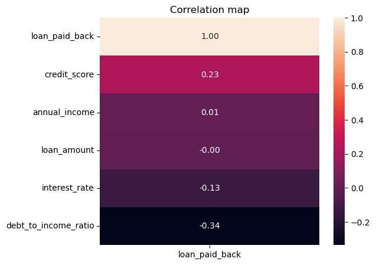
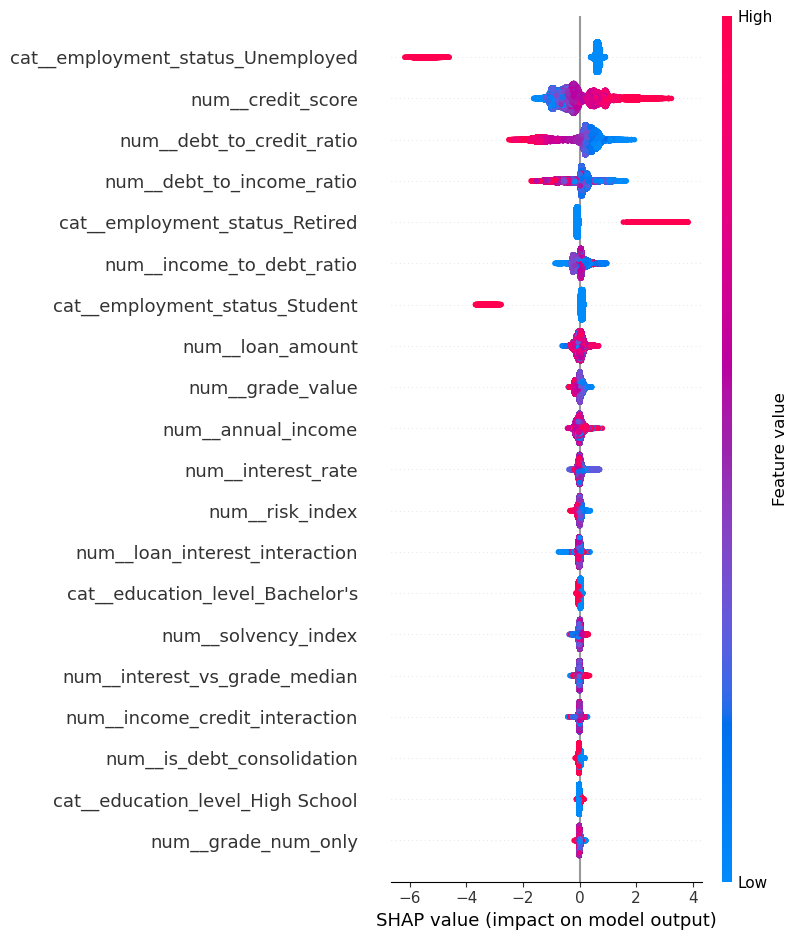

# Credit Loan Payback Prediction

This project was developed as part of the **Kaggle Playground Series – Season 5, Episode 11** competition.  
The goal is to predict the probability that a borrower will successfully repay their loan using tabular financial and demographic data.

🔗 **Competition page:**  
https://www.kaggle.com/competitions/playground-series-s5e11

---

## 🎯 Project Goal

Build a machine learning model that predicts **loan repayment probability** (`loan_paid_back`) based on borrower characteristics, loan parameters, and engineered features.

This is a **binary classification** task evaluated using the **ROC-AUC** metric.

---

## 📊 Dataset Overview

The dataset is **synthetic** and provided by Kaggle as part of the Playground Series.  
It includes:

- **Numerical features** (income, loan amount, credit score, debt ratios, interest rate, etc.)
- **Categorical features** (employment status, education level, loan purpose, grade/subgrade)
- A binary target variable: `loan_paid_back`

---

## 🔍 Exploratory Data Analysis (EDA)

During EDA, the following insights were identified:

- Higher **income** and **credit score** increase repayment probability.
- High **debt-to-income** and **debt-to-credit** ratios strongly increase default risk.
- Loan amount and interest rate influence repayment, but are not decisive on their own.
- Several categorical features (employment status, education, loan purpose) show statistically significant relationships with the target.

📌 *Correlation analysis, statistical tests, and distribution plots were used to support these findings.*

---

## 🧠 Feature Engineering

Additional features were created to improve model performance, including:

- Debt and income ratios
- Risk and solvency indices
- Interaction features (e.g., income × credit score, loan × interest rate)
- Ordinal encoding for loan grades
- One-hot encoding for categorical variables

---

## 🤖 Model

The final model is based on **LightGBM**, trained using a pipeline with:

- Preprocessing (scaling + encoding)
- Stratified validation
- ROC-AUC optimization

---

## 📈 Model Performance

**Best Kaggle Score:**  
**ROC-AUC = 0.9221**

**Validation Metrics:**
- Accuracy: **0.87**
- Strong performance on the majority class (loan repaid)
- Slightly lower recall on defaults due to class imbalance

---

## 🔎 Model Explainability (SHAP)

SHAP values were used to interpret the model and understand feature contributions.

Key findings:
- **Employment status**, **credit score**, and **debt ratios** are the most influential features.
- High credit score increases repayment probability.
- High debt ratios significantly reduce repayment probability.
- Results are consistent with correlation analysis and statistical testing.

---

## 🧪 Tools & Libraries

- Python
- pandas, numpy
- scikit-learn
- LightGBM
- SHAP
- matplotlib, seaborn

---

## 🏁 Conclusion

This project demonstrates a full machine learning workflow:
- Exploratory data analysis
- Feature engineering
- Model training and evaluation
- Explainability using SHAP

The final LightGBM model achieved a strong ROC-AUC score on Kaggle and provides interpretable insights into loan repayment behavior.

---

## 👤 Author

**Ejtolf**  

Kaggle: https://www.kaggle.com/arraylist1402

GitHub: https://github.com/Ejtolf

---

## 📌 Notes

This project was created for **educational and portfolio purposes** as part of the Kaggle Playground Series.
